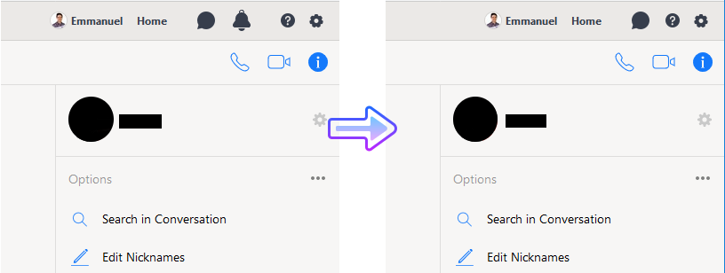

No Bait Workchat
================

Remove the distracting notification icon from the *Workchat by Facebook* layout.

If your company uses the *Workplace* platform (basically a private *Facebook* instance
designed for enterprises), you may probably also use the *Workchat* application (*Facebook
Messenger* equivalent) to chat with your teammates.



How it works
------------
The Javascript file provided is a very simple **Tampermonkey script** that adds a `display: None;`
CSS style to the the notification icon of the *Workchat* layout.

The script does not interact with anything else on the Workplace website.

The Tampermonkey extension itself is used to run so called userscripts (sometimes also called
Greasemonkey scripts).  
More info [here](http://tampermonkey.net/).

The script has been tested with Workchat on Dec. 2017 and **should not interact with the regular
*Facebook* chat**.

If it turns out to be your case, and you don't see the notification area anymore while using the
regular *Facebook Messenger* chat, you may have to edit the javascript Tampermonkey script, so the 
URL of the `@match` script header match exactly the Workplace URL of your company:  
```
// ==UserScript==
// @name         no_bait_workchat
// [ ... ] 
// @match        https://your-company.facebook.com/chat/*
// ==/UserScript==
```

Installation
------------
First install the Tampermonkey extension (compatible with all major browsers):
http://tampermonkey.net/

Then create a new user-script: 
- Click on the little Tampermonkey icon in the top right hand corner of your browser window. 
- Click *create a new user-script* and copy-paste the content of the 
[`no_bait_workchat.js` script file](no_bait_workchat.js) into the Tampermonkey editor window.
- Click save (or hit `Ctrl+s`) and close the Tampermonkey window.

While browsing on the *Workplace* chat, the Tampermonkey icon will display a `(1)` red box, stating
that one user script is being executed on the current page.